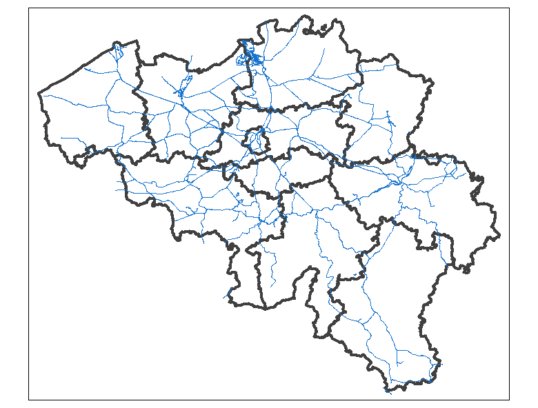
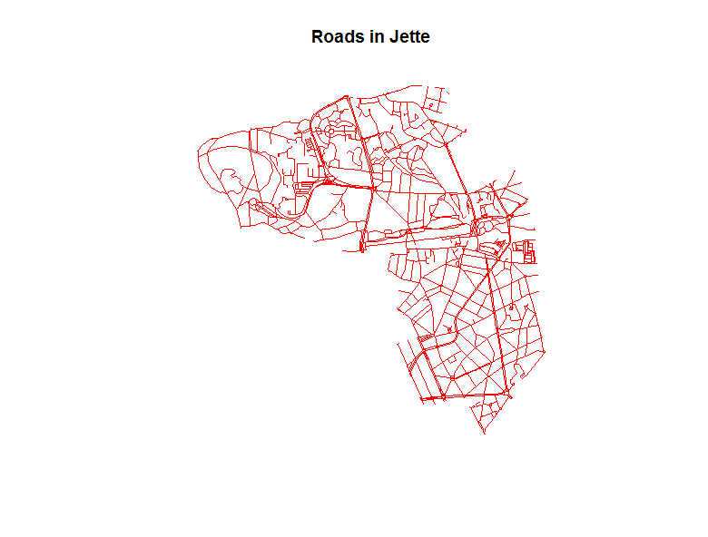
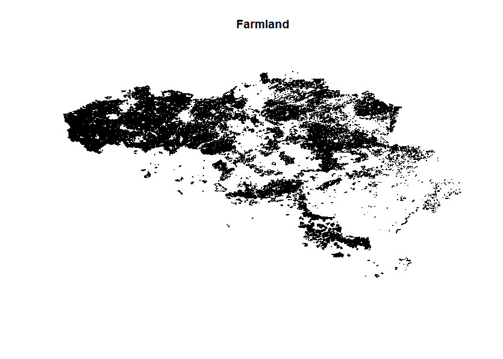

# BelgiumMaps.OpenStreetMap: OpenStreetMap data from Belgium

This R package contains geospatial data extracted from OpenStreetMap about Belgium. It contains detailed information about 

* Places
* Points of interest
* Railways
* Roads
* Landuse
* Waterways

These are basically SpatialPointsDataFrame, SpatialPolygonsDataFrame and SpatialLinesDataFrame objects which are imported from the shapefiles provided by Geofabrik in the file http://download.geofabrik.de/europe/belgium-latest.shp.zip. The data were extracted on 2015/11/03 containing OpenStreetMap data up to 2015-11-02T22:22:02Z.

## Installation

The R packages are currently only available through github. There are no plans to put these packages on CRAN as the data are too big for the CRAN policy and the text of the spatial data is available in UTF-8 instead of ASCII (which is the preferred encoding at CRAN).

To install the latest version from github:
```
devtools::install_github("jwijffels/BelgiumMaps.OpenStreetMap")
```
The package size of BelgiumMaps.OpenStreetMap is approximately 140Mb so **this takes some time to install (+/- 15min)**.


## Administrative boundaries

The package plays nicely with the BelgiumMaps.Admin R package which contains **geographical administrative boundaries in Belgium**. More information on that package: https://github.com/jwijffels/BelgiumMaps.Admin


## Datasets

### Places

Location for cities, towns, etc. Typically somewhere in the centre of the town.

```
library(BelgiumMaps.OpenStreetMap)
library(sp)
data(BE_OSM_PLACES)
table(BE_OSM_PLACES$type)
            city          country             farm           hamlet           island 
               9                1                7             1446                1 
isolated_dwellin         locality    neighbourhood          quarter           suburb 
              52              523              256                5               75 
            town          village              yes 
             376             2905               12 

```

### Points of interest

```
data(BE_OSM_POINTS)
tail(sort(table(BE_OSM_POINTS$type)), 10)
     restaurant     street_lamp traffic_signals  level_crossing    waste_basket  turning_circle 
           4128            4604            5076            5298            6133            6354 
       give_way           bench        crossing        bus_stop 
           6527            7788           37684           69598 

```

### Railways

```
data(BE_OSM_RAILWAYS)
table(BE_OSM_RAILWAYS$type)

library(BelgiumMaps.Admin)
library(tmap) 
data(BE_OSM_ADMIN)
provinces <- subset(BE_OSM_ADMIN, admin.level %in% 6)
rails <- subset(BE_OSM_RAILWAYS, type %in% "rail")
tm_shape(provinces) + tm_borders("grey25", lwd = 4) +
tm_shape(rails) + tm_lines("dodgerblue3")
```



### Roads

All kinds of roads from motorways to gravel tracks as well as cycleways, footpaths, etc.

```
data(BE_OSM_ROADS)
plot(subset(BE_OSM_ROADS, type %in% c("motorway", "primary")))
str(subset(BE_OSM_ROADS@data, type %in% c("residential", "footway"))
'data.frame':  223428 obs. of  8 variables:
 $ osm_id  : chr  "75146" "197576" "504661" "3328634" ...
 $ name    : chr  "Rue de Thiribut" "Rue du Bois des Loges" "Rue Saint-Lambert" "Hertog Engelbertlaan" ...
 $ ref     : chr  NA NA NA NA ...
 $ type    : chr  "residential" "residential" "residential" "residential" ...
 $ oneway  : int  0 0 0 0 0 1 0 0 1 0 ...
 $ bridge  : int  0 0 0 0 0 0 0 0 0 0 ...
 $ tunnel  : int  0 0 0 0 0 0 0 0 0 0 ...
 $ maxspeed: int  NA 30 NA 50 30 NA 30 30 30 NA ...
 
## Example on plotting roads in Jette
library(BelgiumMaps.Admin)
library(rgeos)
data(BE_OSM_ADMIN)
jette <- subset(BE_OSM_ADMIN, name == "Jette")
jette_roads <- gIntersection(BE_OSM_ROADS, SpatialPolygons(jette@polygons), byid=TRUE)
plot(jette_roads, main = "Roads in Jette", col = "red")
```



### Landuse

Land use and land cover (parks, meadows, cemetery, commercial, retail, forests, ...)

```
data(BE_OSM_LANDUSE)
plot(subset(BE_OSM_LANDUSE, type == "farmland"), main = "Farmland")
```



### Waterways

```
data(BE_OSM_WATERWAYS)
plot(subset(BE_OSM_LANDUSE, type == "industrial"))
lines(subset(BE_OSM_WATERWAYS, type %in% c("canal")), col = "blue")
```


More information about the content of these files can be found in the **inst/docs** folder

